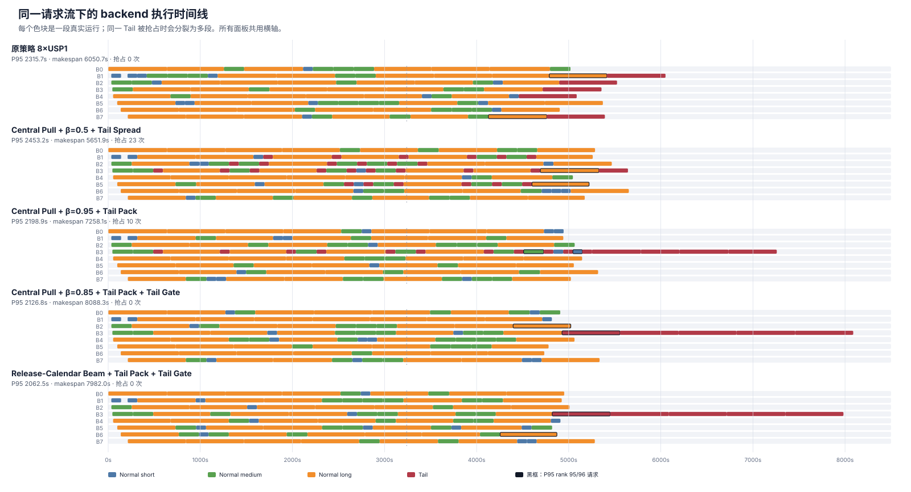
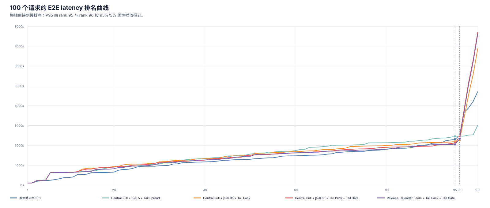
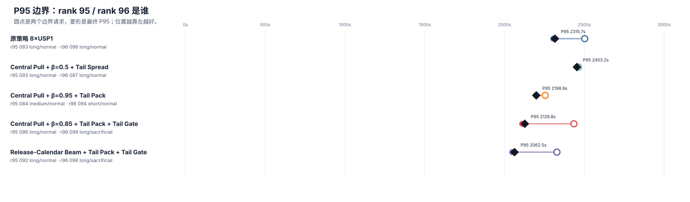
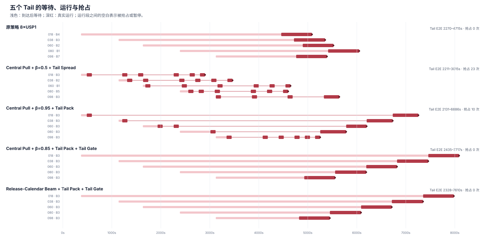

# Wan2.2 8×USP1 五种调度策略的仿真行为

## 仿真口径

- 请求流：`100 requests / 0.03 rps / seed=42`
- 拓扑：`8×USP1`
- 五种策略共用同一批请求和同一组实际服务时间；只改变估时、路由和 Tail 行为。
- P95 使用 benchmark 相同的 NumPy linear / type-7 口径。
- 图中的色块是请求真实占用 backend 的时间；同一个请求被抢占时会显示为多段，但不再拆分 denoise 内部步骤。

## 结果

| 策略 | P50 | P95 | 相对原策略 P95 | P99 | makespan | 真实利用率 | 抢占 |
|---|---:|---:|---:|---:|---:|---:|---:|
| 原策略 8×USP1 | 1314.0s | 2315.7s | — | 4221.8s | 6050.7s | 86.8% | 0 |
| Central Pull + β=0.5 + Tail Spread | 1577.0s | 2453.2s | **变差 5.94%** | 2537.1s | **5651.9s** | **93.0%** | 23 |
| Central Pull + β=0.95 + Tail Pack | 1534.8s | 2198.9s | 降低 5.04%，1.053× | 5608.2s | 7258.1s | 72.4% | 10 |
| Central Pull + β=0.85 + Tail Pack + Tail Gate | 1514.4s | 2126.8s | 降低 8.16%，1.089× | 6334.6s | 8088.3s | 65.0% | 0 |
| Release-Calendar Beam + Tail Pack + Tail Gate | **1492.1s** | **2062.5s** | **降低 10.93%，1.123×** | 6228.2s | 7982.0s | 65.9% | 0 |

这里的百分比只比较仿真内的原策略，不替代 NPU 实测加速比。

## 行为图

## 图中能看出的行为

| 策略 | 做到的事情 | 仍然存在的问题 |
|---|---|---|
| 原策略 | 不抢占；五个 Tail 分散到不同 backend，整体排空较快。 | Normal 负载不平衡，最早和最晚完成 Normal 的 backend 相差 957.0s；rank 95/96 都是等待很久的 long Normal。 |
| β=0.5 + Tail Spread | Tail 提前运行并被 Normal 抢占，23 次抢占填平了空闲时间；利用率最高，makespan 最短。 | β 太低，成本项压过等待风险，旧的 long Normal 被新请求反复越过；P95 反而增加 137.5s。它更像吞吐策略，不是纯 P95 策略。 |
| β=0.95 + Tail Pack | 五个 Tail 全部集中到 backend-3，其余 backend 更专注于 Normal；P95 开始下降。 | Tail 仍提前启动并被抢占 10 次，五个 Tail 的 E2E 扩大到 2131.0–6886.3s；P99 和 makespan 明显恶化。 |
| β=0.85 + Tail Pack + Tail Gate | backend-3 先完成 Normal，再按 LIFO 运行 Tail；没有抢占，最差 Normal 降到 2110.6s。 | Tail 全压在一个 backend，直到 4927.3s 才开始排空；rank 96 已经是最新 Tail，因此 P95 仍被它贡献 5%。 |
| Beam + Tail Pack + Tail Gate | Beam 在 95 次 Normal 拉取中实际规划 45 次，把 Tail backend 的 Normal 释放时间从 4927.3s 提前到 4821.0s；最差 Normal 降到 2048.6s。 | 仍有 50 次拉取因为队列不在当前 planning window 而回退；五个 Tail 串行造成 7982.0s 的 makespan。 |

Beam 相对 `β=0.85 + Tail Pack + Tail Gate`：

- P95 再降低 **64.24s / 3.02%**。
- rank 95 Normal 从 2110.57s 降到 2048.55s。
- rank 96 Tail 从 2434.63s 降到 2328.30s。
- Tail 整体开始和结束都提前约 **106.33s**。

## 下一轮最值得尝试的优化

1. **P95 边界感知的单 Tail 提前释放**
   - Tail Gate 仍保留，但只把“最新的一个 Tail”放入另一个 backend 的安全空闲窗口。
   - 只有当插入 Tail 后，预测的 rank 95 Normal 仍低于当前风险上界时才释放。
   - 目标是直接降低当前 rank 96 Tail 的 2328.30s，同时不抬高 rank 95 Normal。

2. **动态 Tail Pack 宽度**
   - Normal 压力高时仍为单 Tail backend；进入 drain 后允许从 1 个扩大到 2 个 Tail backend。
   - 触发条件使用当前可见队列、backend release calendar 和 Normal 风险，不需要请求总数。
   - 这主要修复单 backend 串行导致的 P99/makespan，若第二个 Tail 进入 rank 96，也可能改善 P95。

3. **动态 β，而不是继续搜索固定 β**
   - 请求刚进入队列时保留 cost-aware；随等待风险上升，逐步提高等待权重。
   - 这样可避免 β=0.5 中 long Normal 被长期越过，也避免全程使用很高 β 丢掉短任务填缝机会。

4. **扩大 Beam 的有效区间**
   - 当前仅在 pending Normal 为 10–27 时使用 Beam，95 次拉取中有 50 次直接回退。
   - 队列较长时可缩短 horizon、减少 branch width；队列较短的 drain 阶段则直接枚举剩余请求。
   - 优先观察 rank 90–96 的等待和 Tail backend 的 Normal 释放时间，而不是只看平均预测收益。

第一优先级建议是“**Beam + Tail Gate + 单 Tail 安全提前释放**”。它最直接对应当前 P95 的两个组成项：rank 95 Normal 和 rank 96 Tail。
